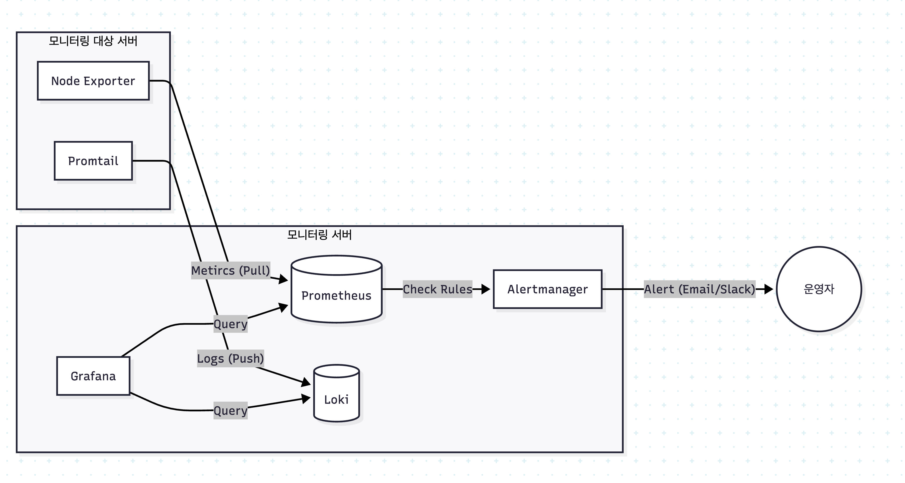

# 오픈소스 모니터링 시스템 가이드 (LGTM Stack)

이 프로젝트는 **Loki**, **Grafana**, **Tempo**, **Prometheus** (일명 LGTM 스택)를 이용한 통합 모니터링 시스템 구축 프로세스를 담고 있습니다.

---

## 📑 가이드 문서 바로가기
각 컴포넌트의 상세 설치 및 설정 방법은 아래 링크를 참조하세요.

1.  [**프로메테우스(Prometheus) 설치 가이드**](./프로메테우스.md) - 메트릭 수집 엔진
2.  [**노드 익스포터(Node Exporter) 설치 가이드**](./노드익스포터.md) - 서버 자원 수집 에이전트
3.  [**알람매니저(Alertmanager) 설정 가이드**](./알람매니저.md) - 장애 알림 전송 시스템
4.  [**그라파나(Grafana) 설정 가이드**](./그라파나.md) - 통합 시각화 대시보드
5.  [**로키(Loki) 설치 및 연동 가이드**](./로키.md) - 로그 통합 관리 시스템
6.  [**템포(Tempo) 설치 및 분산 트레이싱 가이드**](./템포.md) - 분산 트레이싱 및 실행 흐름 추적

---

## 🏗 시스템 아키텍처 및 동작 흐름 (Workflow)

1.  **Metric 수집**: Node Exporter가 서버 자원 정보를 9100 포트로 노출하면, Prometheus가 정기적으로 긁어옵니다(Pull).
2.  **Log 수집**: 
    *   **에이전트 방식**: Promtail이 로그 파일을 실시간으로 읽어 Loki에게 전송합니다.
    *   **다이렉트 방식**: **Spring Boot** 등 애플리케이션에서 `Logback Appender`를 사용하여 직접 Loki로 로그를 전송합니다.
3.  **Trace 수집**: 애플리케이션 내의 실행 흐름(Trace) 정보를 **Micrometer/OpenTelemetry**를 통해 Tempo로 전송합니다.
4.  **장애 감지**: Prometheus는 설정된 규칙에 따라 이상 징후를 감지하면 Alertmanager로 신호를 보냅니다.
5.  **알림 전송**: Alertmanager는 중복된 알람을 필터링하여 이메일 등으로 운영자에게 전송합니다.
6.  **통합 관제 및 연결 분석**: Grafana에서 메트릭-로그-트레이스 간의 상관관계를 분석합니다. (예: 에러 로그 클릭 시 해당 시점의 트레이스 타임라인으로 바로 이동)

---

## ⚔️ PLG 스택 vs ELK 스택 상세 비교

현대 모니터링 시스템의 양대 산맥인 PLG와 ELK 스택의 차이점입니다.

### 1. PLG 스택 (Prometheus + Loki + Grafana)
*   **특징**: 메트릭 수집에 강점이 있는 Prometheus와 구조가 유사한 Loki를 조합한 가벼운 스택입니다.
*   **장점**:
    *   **저비용 고효율**: 로그 전체를 인덱싱하지 않고 '라벨'만 인덱싱하므로 저장 공간과 메모리를 매우 적게 사용합니다.
    *   **상관관계 분석 용이**: Prometheus의 메트릭과 Loki의 로그가 같은 라벨 시스템을 공유하므로, 특정 시점의 그래프에서 바로 로그로 이동하기 편합니다.
*   **단점**: 로그의 상세 내용 검색(Full-text search) 속도는 ELK에 비해 상대적으로 느릴 수 있습니다.

### 2. ELK 스택 (Elasticsearch + Logstash + Kibana)
*   **특징**: 텍스트 검색 엔진인 Elasticsearch를 기반으로 한 전통적인 로그 통합 분석 스택입니다.
*   **장점**:
    *   **강력한 검색**: 대용량 로그 내에서 특정 텍스트를 검색하는 성능이 매우 우수합니다.
    *   **범용성**: 로그뿐만 아니라 일반적인 데이터 검색 엔진으로도 훌륭한 기능을 제공합니다.
*   **단점**:
    *   **높은 리소스 소모**: 모든 로그를 인덱싱하므로 메모리(RAM)와 저장 공간(Disk)을 엄청나게 소모합니다.
    *   **높은 운영 난이도**: 클러스터 구성 및 운영을 위해 전문 인력이 필요할 정도로 복잡합니다.

---

## 🛠 주요 컴포넌트 상세 설명

### 🟢 Prometheus (프로메테우스)
*   **역할**: 시계열 데이터베이스(TSDB) 기반의 메트릭 수집기입니다.
*   **특징**: 대상 서버가 데이터를 주는 것이 아니라, 프로메테우스가 직접 가서 데이터를 가져오는 'Pull 방식'을 사용하여 대상 서버의 부하를 조절하기 쉽습니다.

### 🟡 Loki (로키)
*   **역할**: 프로메테우스의 철학을 계승한 로그 수집 시스템입니다.
*   **특징**: 로그의 내용 대신 발생 위치나 서버 이름 같은 '라벨'만 인덱싱하여 매우 가볍고 빠릅니다.

### 🔴 Tempo (템포)
*   **역할**: 분산 트레이싱(Distributed Tracing) 데이터를 저장하고 조회하는 엔진입니다.
*   **특징**: 로그에서 특정 요청의 전체 실행 경로를 타임라인 형태로 시각화해 줍니다. 마이크로서비스 환경에서 병목 지점을 찾거나 오류 원인을 파악하는 데 필수적입니다.

### 🔵 Grafana (그라파나)
*   **역할**: 여러곳에 흩어진 데이터 소스를 하나로 모아 보여주는 시각화 도구입니다.
*   **특징**: 프로메테우스, 로키, 템포를 한 화면에서 연결하여 '메트릭 -> 로그 -> 트레이스'로 이어지는 완벽한 관찰 가능성(Observability)을 제공합니다.
